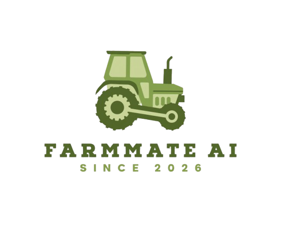



  

<h3 align="center">FarmMate AI</h3>

---

FarmMate AI is a thesis project for smart agricultural advisory. It combines a Python FastAPI backend, AI/knowledge graph services, and a React + Vite frontend to support intelligent chat, document retrieval, and knowledge visualization.

## 📝 Table of Contents

- [About](#about)
- [Architecture](#architecture)
- [Getting Started](#getting-started)
- [Development](#development)
- [Testing](#testing)
- [Deployment](#deployment)
- [Built Using](#built-using)
- [Authors](#authors)
- [Acknowledgements](#acknowledgements)

## 🧐 About 

FarmMate AI is an agricultural AI platform built to help farmers and agronomists ask questions, explore domain knowledge, and navigate farm planning guidance. The backend ingests documents, manages knowledge base workflows with Neo4j, and exposes an API for conversational retrieval. The frontend delivers an interactive chat UI, conversation history, and knowledge visualization tools.

## 🏗️ Architecture 

This repository follows a monorepo layout with two main applications:

- Backend/
  - FastAPI backend application with API routing under /api/v1
  - Includes database initialization, authentication, document ingestion, and AI retrieval logic
  - Uses Neo4j for graph-based knowledge storage and LangChain for LLM orchestration
- Frontend/
  - React + Vite frontend application using Tailwind CSS, Zustand, and React Router
  - Provides chat, conversation history, and knowledge exploration interfaces
- docker-compose.dev.yml
  - Development stack for backend, frontend, and Neo4j with hot reload
- docker-compose.yml
  - Production container definitions for backend, frontend, and Neo4j

## 🚀 Getting Started 

### Development with Docker

`powershell
docker compose -f docker-compose.dev.yml up --build
`

Then access:

- Frontend: http://localhost:5173
- Backend API: http://localhost:8000
- Neo4j Browser: http://localhost:7474

### Backend local setup

`powershell
cd backend
python -m venv .venv
.\.venv\Scripts\Activate
python -m pip install --upgrade pip
python -m pip install -e .
`

Run the backend locally:

`powershell
uv sync && uvicorn main:app --host 0.0.0.0 --port 8000 --reload
`

### Frontend local setup

`powershell
cd frontend
npm install
npm run dev -- --host
`

## 🧪 Testing 

### Backend tests

`powershell
cd backend
.\.venv\Scripts\Activate
pytest
`

### Frontend checks

`powershell
cd frontend
npm run lint
`

## 🚢 Deployment 

### Production deployment

`powershell
docker compose up --build
`

### Production services

- ackend runs FastAPI on port 8000
- rontend serves the React app on port 80
- 
eo4j exposes ports 7474 and 7687

> Make sure ackend/.env is populated with required environment variables before production deployment.

## ⛏️ Built Using 

- Python 3.14+, FastAPI, Uvicorn, LangChain, Neo4j, SQLAlchemy, Alembic
- React 19, Vite, Tailwind CSS, Zustand, React Router
- Docker Compose for local and production orchestration
- Neo4j graph database for agricultural knowledge modeling

## ✍️ Authors 

- FarmMate AI thesis project team

## 🎉 Acknowledgements 

- Built as part of a university thesis project in agricultural AI.
- Uses open source tools for AI, graph databases, and frontend development.
